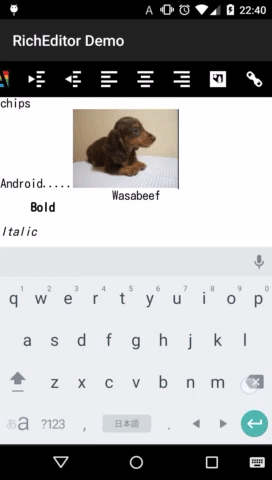

<p align="center">
  <a href="https://pub.dev/packages/flutter_gen">
    
  </a>
</p>
<p align="center">
  <a href="https://android-arsenal.com/details/1/1696">
    
  </a>
  <a href="https://www.apache.org/licenses/LICENSE-2.0">
    
  </a>
  <a href="https://bintray.com/wasabeef/maven/richeditor-android/_latestVersion">
    
  </a>
</p>

`RichEditor for Android` is a beautiful Rich Text `WYSIWYG Editor` for `Android`.

- _Looking for iOS? Check out_ [cjwirth/RichEditorView](https://github.com/cjwirth/RichEditorView)

Supported Functions
---


- [x] Bold
- [x] Italic
- [x] Subscript
- [x] Superscript
- [x] Strikethrough
- [x] Underline
- [x] Justify Left
- [x] Justify Center
- [x] Justify Right
- [x] Blockquote
- [x] Heading 1
- [x] Heading 2
- [x] Heading 3
- [x] Heading 4
- [x] Heading 5
- [x] Heading 6
- [x] Undo
- [x] Redo
- [x] Indent
- [x] Outdent
- [x] Insert Image
- [x] Insert Youtube
- [x] Insert Video
- [x] Insert Audio
- [x] Insert Link
- [x] Checkbox
- [x] Text Color
- [x] Text Background Color
- [x] Text Font Size
- [x] Unordered List (Bullets)
- [x] Ordered List (Numbers)

Attribute change of editor
---
- [x] Font Size
- [x] Background Color
- [x] Width
- [x] Height
- [x] Placeholder
- [x] Load CSS
- [x] State Callback

**Milestone**

- [ ] Font Family

Demo
---



Samples
---

<a href="https://play.google.com/store/apps/details?id=jp.wasabeef.sample"></a>

How do I use it?
---

### Setup

##### Gradle
```groovy
dependencies {
  implementation 'jp.wasabeef:richeditor-android:2.x.x'
}
```
### Default Setting for Editor
---

**Height**
```java
editor.setEditorHeight(200);
```

**Font**
```java
editor.setEditorFontSize(22);
editor.setEditorFontColor(Color.RED);
```

**Background**
```java
editor.setEditorBackgroundColor(Color.BLUE);
editor.setBackgroundColor(Color.BLUE);
editor.setBackgroundResource(R.drawable.bg);
editor.setBackground("https://raw.githubusercontent.com/wasabeef/art/master/chip.jpg");
```

**Padding**
```java
editor.setPadding(10, 10, 10, 10);
```

**Placeholder**
```java
editor.setPlaceholder("Insert text here...");
```

**Others**  
Please refer the [samples](https://github.com/wasabeef/richeditor-android/blob/master/sample/src/main/java/jp/wasabeef/sample/MainActivity.java) for usage.

### Functions for ContentEditable
---

**Bold**
```java
editor.setBold();
```

**Italic**
```java
editor.setItalic();
```

**Insert Image**
```java
editor.insertImage("https://raw.githubusercontent.com/wasabeef/art/master/twitter.png","twitter");
```

**Text Change Listener**
```java
RichEditor editor = (RichEditor) findViewById(R.id.editor);
editor. setOnTextChangeListener(new RichEditor.OnTextChangeListener() {
  @Override
  public void onTextChange(String text) {
    // Do Something
     Log.d("RichEditor", "Preview " + text);
  }
});
```

**Others**  
Please refer the [samples](https://github.com/wasabeef/richeditor-android/blob/master/sample/src/main/java/jp/wasabeef/sample/MainActivity.java) for usage.

Requirements
--------------
Android 4+

Applications using RichEditor for Android
---

Please [ping](mailto:dadadada.chop@gmail.com) me or send a pull request if you would like to be added here.

Icon | Application
------------ | -------------
 | [Ameba Ownd](https://play.google.com/store/apps/details?id=jp.co.cyberagent.madrid)
 | [ScorePal](https://play.google.com/store/apps/details?id=com.hfd.scorepal)

Developed By
-------
Daichi Furiya (Wasabeef) - <dadadada.chop@gmail.com>

<a href="https://twitter.com/wasabeef_jp">

</a>

Thanks
-------

* Inspired by `ZSSRichTextEditor` in [nnhubbard](https://github.com/nnhubbard/ZSSRichTextEditor).

License
-------

    Copyright (C) 2020 Wasabeef

    Licensed under the Apache License, Version 2.0 (the "License");
    you may not use this file except in compliance with the License.
    You may obtain a copy of the License at

       http://www.apache.org/licenses/LICENSE-2.0

    Unless required by applicable law or agreed to in writing, software
    distributed under the License is distributed on an "AS IS" BASIS,
    WITHOUT WARRANTIES OR CONDITIONS OF ANY KIND, either express or implied.
    See the License for the specific language governing permissions and
    limitations under the License.
